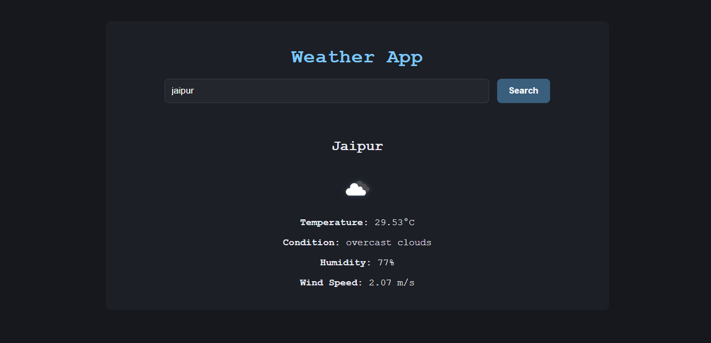

## Weather App using OpenWeatherMap API

## Overview
A simple web app that fetches and displays current weather data for a city using the OpenWeatherMap API.

## Features
- Fetches and shows current temperature, humidity, wind speed, and weather description.
- Displays weather icons from OpenWeatherMap.
- User inputs city name via a form.
- Handles errors for invalid city names.
- 
## Setup & Usage
1. Get an OpenWeatherMap API key from [https://openweathermap.org/api](https://openweathermap.org/api).
2. Insert your API key in the JavaScript code (`const apiKey = 'YOUR_API_KEY_HERE';`).
3. Open the `index.html` in a browser.
4. Enter a city name and submit to see the current weather.

## Testing

- Use browser Developer Tools (Console & Network tab) to inspect API requests and responses.
- Test with valid and invalid city names to verify correct data display and error handling.

---

Enjoy building your weather app!
